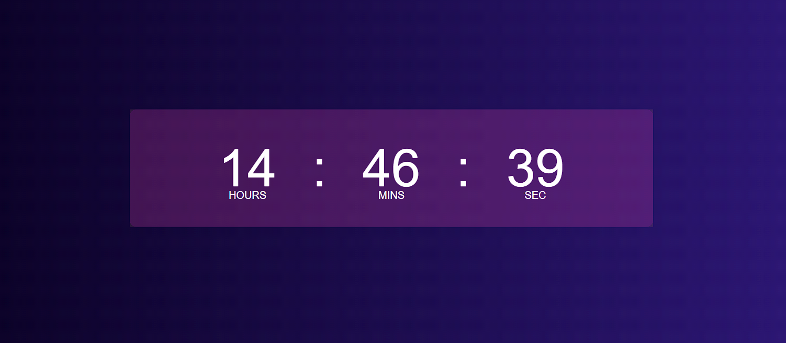

# 🕒 Digital Clock

A simple and responsive digital clock built using **HTML**, **CSS**, and **JavaScript**. It displays the current time in real-time and updates every second.

## 🔗 Live Demo

👉 [Click here to view the live clock](https://vaibhav3123.github.io/Digital-Clock/)

## 🚀 Features

- Displays current time in **HH:MM:SS** format
- Real-time update every second
- Responsive and clean design
- Built with pure HTML, CSS, and JavaScript (no libraries)

## 📷 Preview

